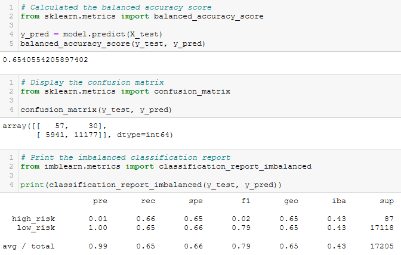
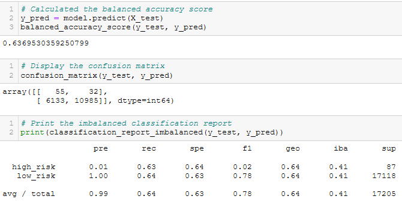
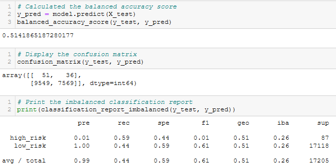
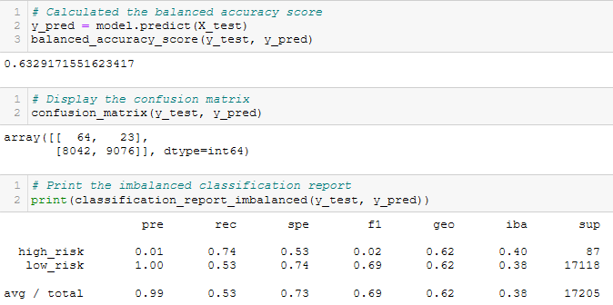
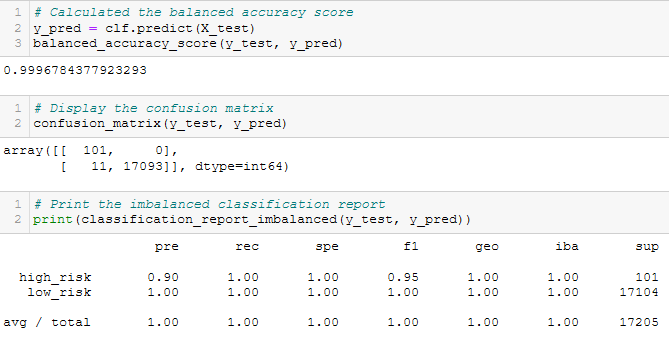
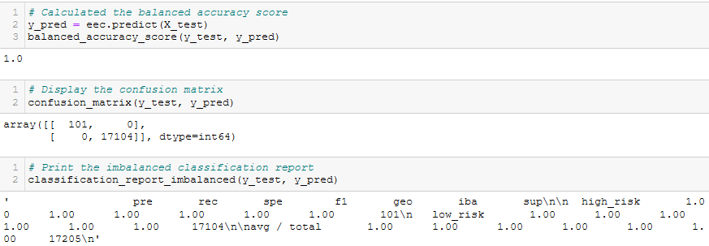

# Credit Risk Analysis
## Overview
For this challenge, we were given loan data and asked to perform several supervised machine learning models on the data to determine which of the models worked best to predict whether a loan request would be approved. 

## Results
Below is a detailed list of the six supervised models used to fit the loan data and their performances:
    
* RandomOverSampler:
    * The balance accuracy score for this model is 65%
    * Due to how few high_risk loans there are, it has caused a   big discrepency between the F1 scores for high_risk and low_risk loans.

    

* SMOTE
    * The SMOTE model results are very similar to the RandomOverSampler, with a balance accuracy of 64%, as well as similar F1 scores. 

    

* ClusterCentroids
    * The ClusterCentroids model performed the worst with a balance accuracy of 51%.
    * The precision and recall for high_risk loans are 1% and 59%, and 100% and 44% for low_risk loans, respectively.

    

* SMOTEENN
    * Using a combination of over and undersampling, the SMOTEENN model produced a balance accuracy of 63%.
    * However, the model is still has an imbalance in the F1 scores for the high_risk and low_risk loans.

    

* BalancedRandomForestClassifier
    * Switching to ensemble classifiers gives us the best results, with the first balance accuracy of 99.6%.
    * The BalancedRandomForest has a precision of 90% for high_risk loans and 100% for low_risk, having the best F1 scores of 95% and 100%.

    

* EasyEnsembleClassifier
    * Similar to the previous model, EasyEnsemble fit the data with 100% balance accuracy.

    

## Summary
The over and undersampling models did not get a balance accuracy above 65%, leading them to be bad indicators of credit risk, especially given the number of low-risk loans that were predicted to be high-risk, which could be sound investments the bank would miss out on. While the EasyEnsembleClassifier does produce a 100% balance accuracy, I would hesitate to use the model without further investigating why it was able to acheive a perfect score. Therefore, with an accuracy rating of 99%, and high precision for both types of risk, I would recommend using the BalancedRandomForestClassifier as a relatively good prediction of credit risk.